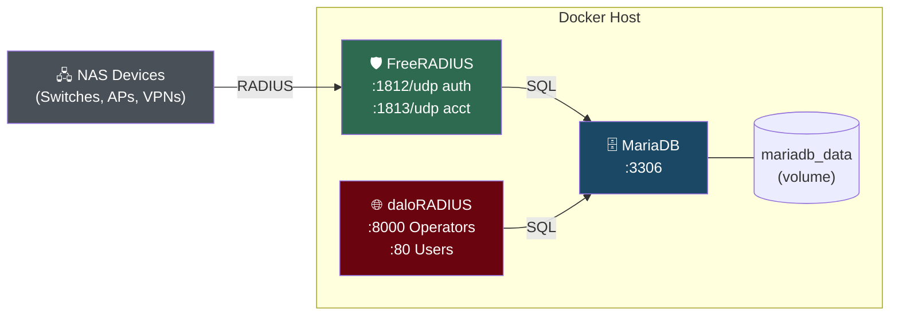
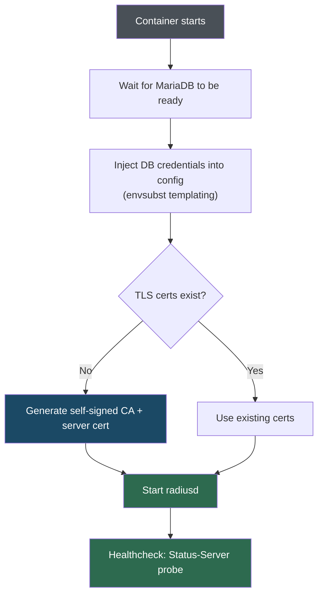

# FreeRADIUS Production Docker Stack

A fully containerized, production-ready FreeRADIUS 3.x deployment with MariaDB backend, 802.1X EAP support, and operational tooling.

> **Full Documentation:** See the [`docs/`](docs/) folder for a complete 12-part tutorial series — from RADIUS basics to production HA. Jump to the [Learning Path](#learning-path) for a guided roadmap.

---

## Architecture



**Services:**

| Service      | Image              | Ports              | Purpose                          |
|--------------|--------------------|--------------------|----------------------------------|
| freeradius   | freeradius/freeradius-server:3.2 | 1812/udp, 1813/udp | RADIUS authentication & acct     |
| mariadb      | mariadb:11         | 3306 (localhost)   | User/group/accounting database   |
| daloradius   | Custom (Debian 11) | 8000 (operators), 80 (users) | Web management UI (optional, `--profile management`) |

---

## Quick Start

### Prerequisites

| Requirement | Minimum | Recommended |
|-------------|---------|-------------|
| Docker Engine | 20.10+ | 24.x+ |
| Docker Compose | v2.0+ | v2.20+ |
| RAM | 1 GB free | 2 GB+ |
| Disk | 500 MB | 2 GB+ |
| OS | Linux / Windows / macOS | Linux (production) |

```bash
# Verify prerequisites
docker --version          # Docker Engine 20.10+
docker compose version    # Compose v2+
```

### Step-by-step setup


#### 1. Clone the repository

```bash
git clone https://github.com/AhmadAsn/freeradius-learning.git
cd freeradius-learning
```

#### 2. Configure environment

```bash
cp .env.example .env
```

Edit `.env` and **change all passwords and secrets** — never use the defaults in production:

```bash
# Generate strong random passwords
openssl rand -base64 24    # Use output for DB_ROOT_PASSWORD
openssl rand -base64 24    # Use output for DB_PASSWORD
openssl rand -base64 24    # Use output for RADIUS_CLIENTS_SECRET
```

> **Tip:** If your password contains `$`, escape it: `DB_PASSWORD=my\$ecret`

#### 3. Build and start

```bash
make build    # Build the FreeRADIUS Docker image
make up       # Start FreeRADIUS + MariaDB
```

Wait ~30 seconds for first boot (database initialization + TLS certificate generation).

#### 4. Verify everything works

```bash
make status       # All containers should show "healthy"
make test         # Should output: "Access-Accept" ✅
```

Expected `make test` output:

```
Sending Access-Request of id 42 to 127.0.0.1 port 1812
  User-Name = "testuser"
  User-Password = "TestPass123!"
Received Access-Accept Id 42 from 127.0.0.1:1812 to ...
```

Run the full suite:

```bash
make test-all     # Tests PAP, admin, guest, reject, and status-server
```

#### 5. Add your first user

```bash
# Add a user to the "employees" group (VLAN 100)
make add-user USER=jdoe PASS='MyP@ssw0rd!' GROUP=employees

# Verify authentication
docker exec freeradius radtest jdoe 'MyP@ssw0rd!' 127.0.0.1 0 testing123
```

#### 6. (Optional) Start the web UI

```bash
make mgmt-up     # Start daloRADIUS management interface
```

Open `http://localhost:8000` — login: `administrator` / `radius`

> See [daloRADIUS Guide](docs/07-daloradius-guide.md) for portal details.

### What happens on first boot?



---

## Learning Path

The [`docs/`](docs/) folder contains a complete **12-part tutorial series** that takes you from zero RADIUS knowledge to production deployment. Follow the guides in order:

```mermaid
flowchart TD
    subgraph Fundamentals
        A["📖 01 - Getting Started<br/><i>Install, first boot, first test</i>"]
        B["📖 02 - RADIUS Concepts<br/><i>AAA, packets, EAP, processing pipeline</i>"]
        C["📖 03 - Configuration Reference<br/><i>All config files &amp; env vars</i>"]
    end

    subgraph Authentication
        D["📖 04 - Authentication Methods<br/><i>PAP, CHAP, MSCHAP, EAP-PEAP/TTLS/TLS</i>"]
        E["📖 05 - 802.1X Deployment<br/><i>Switch config, supplicants, MAB, VLAN</i>"]
    end

    subgraph Management
        F["📖 06 - Database &amp; User Management<br/><i>Schema, SQL, groups, accounting</i>"]
        G["📖 07 - daloRADIUS Guide<br/><i>Web UI, operators &amp; users portals</i>"]
    end

    subgraph Advanced
        H["📖 08 - LDAP &amp; Active Directory<br/><i>AD integration, group mapping</i>"]
        I["📖 09 - TLS Certificates<br/><i>PKI, cert rotation, production certs</i>"]
    end

    subgraph Production
        J["📖 10 - Security Hardening<br/><i>Firewall, fail2ban, checklist</i>"]
        K["📖 11 - Troubleshooting<br/><i>Common errors, debug procedures</i>"]
        L["📖 12 - High Availability<br/><i>Active/passive, Galera, load balancing</i>"]
    end

    A --> B --> C --> D --> E --> F --> G --> H --> I --> J --> K --> L

    style A fill:#2d6a4f,color:#fff
    style B fill:#2d6a4f,color:#fff
    style C fill:#2d6a4f,color:#fff
    style D fill:#1b4965,color:#fff
    style E fill:#1b4965,color:#fff
    style F fill:#6a040f,color:#fff
    style G fill:#6a040f,color:#fff
    style H fill:#495057,color:#fff
    style I fill:#495057,color:#fff
    style J fill:#264653,color:#fff
    style K fill:#264653,color:#fff
    style L fill:#264653,color:#fff
```



### Guide Index

| # | Guide | What You'll Learn | Prerequisite |
|---|-------|-------------------|--------------|
| 01 | [Getting Started](docs/01-getting-started.md) | Install Docker, clone the repo, first `radtest` | None |
| 02 | [RADIUS Concepts](docs/02-radius-concepts.md) | AAA model, packet types, AVPs, EAP overview, processing pipeline | None |
| 03 | [Configuration Reference](docs/03-configuration-reference.md) | Every config file, environment variable, and templating mechanism | Guide 01 |
| 04 | [Authentication Methods](docs/04-authentication-methods.md) | PAP, CHAP, MS-CHAPv2, EAP-PEAP, EAP-TTLS, EAP-TLS — when & how | Guide 02 |
| 05 | [802.1X Deployment](docs/05-802.1x-deployment.md) | Switch/AP config, supplicant setup, MAB, VLAN assignment | Guides 03–04 |
| 06 | [Database & User Management](docs/06-database-user-management.md) | Schema, SQL queries, groups, accounting, Makefile shortcuts | Guide 03 |
| 07 | [daloRADIUS Guide](docs/07-daloradius-guide.md) | Web UI walkthrough, operators vs users portal, reports | Guide 06 |
| 08 | [LDAP & Active Directory](docs/08-ldap-active-directory.md) | AD bind config, group-to-VLAN mapping, LDAPS | Guides 04, 06 |
| 09 | [TLS Certificates](docs/09-tls-certificates.md) | Auto-generated PKI, production certs, rotation procedures | Guide 05 |
| 10 | [Security Hardening](docs/10-security-hardening.md) | Production checklist, firewall rules, fail2ban, secrets management | Guides 01–09 |
| 11 | [Troubleshooting](docs/11-troubleshooting.md) | Common errors, debug mode, log analysis, packet captures | Any |
| 12 | [High Availability](docs/12-high-availability.md) | Active/passive, active/active, Galera cluster, keepalived | Guide 10 |

### Recommended paths by role

| Your Role | Start With | Then |
|-----------|-----------|------|
| **Complete beginner** | 01 → 02 → 03 | Follow all guides in order |
| **Network engineer** | 02 → 05 → 09 | Focus on 802.1X and certs |
| **Sysadmin / DevOps** | 01 → 03 → 06 → 10 | Focus on deployment and hardening |
| **Windows/AD admin** | 02 → 04 → 08 | Focus on PEAP + Active Directory |
| **Just exploring** | 01 → 07 | Get running, manage via web UI |

---

## daloRADIUS Management UI

daloRADIUS is an optional web-based management interface for FreeRADIUS. It provides **two separate portals** running on different ports:

| Portal | URL | Purpose | Authenticates Against |
|--------|-----|---------|----------------------|
| **Operators** (Admin) | `http://localhost:8000` | Full administration: manage users, groups, NAS devices, accounting, reports | `operators` table |
| **Users** (Self-service) | `http://localhost:80` | User self-service: view usage, change password | `userinfo` table |

### Default Credentials

| Portal | Username | Password |
|--------|----------|----------|
| Operators (Admin) | `administrator` | `radius` |

> **Important:** Change the default admin password immediately after first login via **Management → Operators → Edit Operator**.

> **Common mistake:** If you see "Cannot Log In", verify you're accessing the correct portal. The **admin login** is on port **8000** (`http://localhost:8000`), NOT port 80. Port 80 is the users self-service portal, which authenticates against a different table.

### Starting / Stopping daloRADIUS

daloRADIUS uses a Docker Compose [profile](https://docs.docker.com/compose/profiles/) and does not start by default:

```bash
make mgmt-up       # Start daloRADIUS
make mgmt-down     # Stop daloRADIUS
```

### Users Self-Service Portal

For end users to access the self-service portal (port 80), their account must exist in the `userinfo` table with `enableportallogin = 1` and a `portalloginpassword` set. This is separate from their RADIUS credentials in `radcheck`.

---

## Project Structure

```
freeradius-docker/
├── docker-compose.yml                # Stack orchestration
├── .env.example                      # Environment template
├── .gitignore
├── Makefile                          # Operations commands
│
├── freeradius/
│   ├── Dockerfile                    # FreeRADIUS image (based on freeradius/freeradius-server)
│   ├── .dockerignore
│   ├── scripts/
│   │   ├── entrypoint.sh            # DB wait, config injection, cert gen
│   │   ├── healthcheck.sh           # Status-Server probe
│   │   └── generate-certs.sh        # Self-signed CA + server cert for EAP
│   └── config/
│       ├── radiusd.conf              # Main daemon config
│       ├── clients.conf              # NAS device definitions
│       ├── proxy.conf                # Proxy/federation (disabled)
│       ├── users                     # Local fallback users
│       ├── certs/                    # Mount production TLS certs here
│       ├── sites-available/
│       │   ├── default               # Primary virtual server
│       │   └── inner-tunnel          # EAP Phase 2
│       ├── mods-available/
│       │   ├── eap                   # EAP-TLS / PEAP / TTLS
│       │   ├── sql                   # MariaDB backend
│       │   ├── ldap                  # LDAP / Active Directory
│       │   └── mschap               # MS-CHAPv2
│       └── policy.d/
│           ├── canonicalization      # Username/MAC normalization
│           └── rate-limiting         # Brute-force prevention
│
├── daloradius/
│   ├── Dockerfile                    # daloRADIUS image (Debian 11-slim + Apache + PHP)
│   ├── entrypoint.sh                # Config injection, schema import, Apache setup
│   ├── apache-operators.conf        # VirtualHost *:8000 → /app/operators
│   └── apache-users.conf            # VirtualHost *:80   → /app/users
│
├── db/
│   ├── init/
│   │   ├── 01-schema.sql            # Tables (auto-run on first start)
│   │   └── 02-seed-data.sql         # Sample users and groups
│   └── scripts/
│       └── db-maintenance.sh        # Accounting log cleanup
│
└── management/                       # (reserved for future tooling)
```

---

## Configuration Templating

The entrypoint uses `envsubst` (from `gettext-base`) to inject environment variables into FreeRADIUS config files at startup. This is safer than `sed`-based replacement because it handles special characters in passwords (e.g., `&`, `/`, `\`, `$`) without corruption.

**How it works:**
- Config files use `${VAR_NAME}` placeholders (e.g., `${DB_HOST}`, `${DB_PASSWORD}`)
- `envsubst` is called with an **explicit variable list** so FreeRADIUS's own `${certdir}`, `${modconfdir}`, etc. are preserved
- The substituted file replaces the original atomically (`envsubst ... > file.tmp && mv file.tmp file`)

**Templated files:**
| File | Variables injected |
|------|-------------------|
| `mods-available/sql` | `DB_HOST`, `DB_PORT`, `DB_NAME`, `DB_USER`, `DB_PASSWORD` |
| `clients.conf` | `RADIUS_CLIENTS_SECRET` |

> **Tip:** If your password contains `$`, escape it in your `.env` file: `DB_PASSWORD=my\$ecret` or use single quotes in `docker-compose.yml` environment section.

---

## Configuration

### Environment Variables (`.env`)

| Variable               | Default                         | Description                     |
|------------------------|---------------------------------|---------------------------------|
| `DB_ROOT_PASSWORD`     | `CHANGE_ME_root_pw_...`         | MariaDB root password           |
| `DB_NAME`              | `radius`                        | Database name                   |
| `DB_USER`              | `radius`                        | Database service account        |
| `DB_PASSWORD`          | `CHANGE_ME_radius_pw_...`       | Database password               |
| `DB_EXTERNAL_PORT`     | `3307`                          | DB port (localhost only)        |
| `RADIUS_AUTH_PORT`     | `1812`                          | RADIUS auth port                |
| `RADIUS_ACCT_PORT`     | `1813`                          | RADIUS accounting port          |
| `RADIUS_CLIENTS_SECRET`| `CHANGE_ME_...`                 | Default NAS shared secret       |
| `RADIUS_DEBUG`         | `false`                         | Enable verbose debug mode       |
| `DALORADIUS_PORT`      | `8000`                          | daloRADIUS operators portal port|
| `DALORADIUS_USERS_PORT`| `80`                            | daloRADIUS users portal port    |
| `TZ`                   | `UTC`                           | Container timezone              |

> **Generate strong passwords:** `openssl rand -base64 24`

### TLS Certificates

#### Auto-generated (default)

The entrypoint runs `generate-certs.sh` on first boot to create a full self-signed PKI:

| File         | Description                    | Validity |
|--------------|--------------------------------|----------|
| `ca.pem`     | Self-signed CA certificate     | 10 years |
| `ca.key`     | CA private key                 | —        |
| `server.pem` | Server cert (signed by CA)     | 825 days |
| `server.key` | Server private key             | —        |
| `dh`         | Diffie-Hellman parameters      | —        |

Customize the generated certificates with environment variables:

| Variable           | Default              | Description                 |
|--------------------|----------------------|-----------------------------|
| `CERT_CA_CN`       | `FreeRADIUS CA`      | CA Common Name              |
| `CERT_SERVER_CN`   | `radius.local`       | Server Common Name          |
| `CERT_ORG`         | `FreeRADIUS Docker`  | Organization                |
| `CERT_COUNTRY`     | `US`                 | ISO country code            |
| `CERT_STATE`       | `California`         | State / Province            |
| `CERT_CITY`        | `San Francisco`      | City / Locality             |
| `CERT_DAYS_CA`     | `3650`               | CA validity (days)          |
| `CERT_DAYS_SERVER` | `825`                | Server cert validity (days) |
| `DH_BITS`          | `2048`               | DH parameter bit size       |

> **Note:** Self-signed certs are fine for testing. For production, replace with PKI-signed certificates (see below).

#### Production certificates

Mount your PKI-signed certificates into `freeradius/config/certs/`:

```
freeradius/config/certs/
├── ca.pem          # CA certificate (+ intermediates)
├── server.pem      # Server certificate
├── server.key      # Server private key
└── dh              # DH parameters (openssl dhparam -out dh 2048)
```

Every 802.1X supplicant must trust `ca.pem`. Distribute via MDM or GPO.

#### Certificate rotation

```bash
# 1. Back up existing certs
cp -r freeradius/config/certs/ freeradius/config/certs.bak/

# 2. Replace certificate files
cp /path/to/new/ca.pem     freeradius/config/certs/ca.pem
cp /path/to/new/server.pem freeradius/config/certs/server.pem
cp /path/to/new/server.key freeradius/config/certs/server.key

# 3. Restart FreeRADIUS (zero-downtime if behind a VIP)
make restart

# 4. Verify EAP is working
make test
```

#### Re-generate self-signed certs

To force new self-signed certificate generation, remove the existing certs and restart:

```bash
rm -f freeradius/config/certs/server.pem
make restart    # entrypoint.sh will detect missing cert and regenerate
```

### Adding NAS Devices

Edit `freeradius/config/clients.conf` and add entries:

```
client my-switch {
    ipaddr    = 10.0.1.1
    secret    = MyStr0ngUnique$ecret
    nastype   = cisco
    shortname = sw01
    require_message_authenticator = yes
}
```

Then restart: `make restart`

### LDAP / Active Directory

1. Edit `freeradius/config/mods-available/ldap` with your AD details
2. Enable the module:
   ```bash
   # Add to Dockerfile or run inside container:
   ln -sf ../mods-available/ldap /etc/raddb/mods-enabled/ldap
   ```
3. Uncomment `-ldap` lines in `sites-available/default` and `inner-tunnel`
4. Rebuild: `make build && make up`

---

## Operations

### Makefile Commands

```bash
# Lifecycle
make build              # Build the FreeRADIUS image
make up                 # Start all services
make down               # Stop all services
make restart            # Restart FreeRADIUS only
make clean              # Remove everything (containers, volumes, images)

# Logs
make logs               # Tail all logs
make logs-radius        # Tail FreeRADIUS only
make logs-db            # Tail MariaDB only

# Testing
make test               # Test PAP auth (testuser)
make test-admin         # Test admin auth
make test-guest         # Test guest auth
make test-reject        # Confirm invalid user is rejected
make test-status        # Status-Server probe
make test-all           # Run all tests

# User Management
make add-user USER=jdoe PASS=MyP@ss GROUP=employees
make list-users
make delete-user USER=jdoe

# Note: DB credentials are read from .env automatically.
# Override if needed: make list-users DB_PASS=mypass

# Debugging
make debug              # Restart FreeRADIUS in verbose debug mode
make validate           # Validate config without restarting
make shell              # Shell into FreeRADIUS container
make db-shell           # MariaDB CLI

# Maintenance
make db-maintenance     # Purge old accounting/postauth records

# Management UI
make mgmt-up            # Start daloRADIUS
make mgmt-down          # Stop daloRADIUS
```

### Database Maintenance

Accounting records grow indefinitely. Schedule cleanup:

```bash
# Add to host crontab:
0 3 * * 0  cd /path/to/freeradius-docker && make db-maintenance
```

Defaults: 365 days accounting, 90 days post-auth. Override with environment variables `ACCT_RETENTION_DAYS` and `POSTAUTH_RETENTION_DAYS`.

---

## Authentication Methods

| Method          | Use Case                     | Inner Auth | Config                |
|-----------------|------------------------------|------------|-----------------------|
| PAP             | Simple password (testing)    | —          | Enabled by default    |
| CHAP            | Legacy NAS                   | —          | Enabled by default    |
| EAP-PEAP        | Windows 802.1X (most common) | MSCHAPv2   | Enabled by default    |
| EAP-TTLS        | Cross-platform 802.1X        | PAP/MSCHAP | Enabled by default    |
| EAP-TLS         | Certificate-only 802.1X      | —          | Enabled (needs certs) |
| MS-CHAPv2       | VPN authentication           | —          | Enabled by default    |

### VLAN Assignment (pre-configured groups)

| Group         | VLAN | Extra Attributes                     |
|---------------|------|--------------------------------------|
| `employees`   | 100  | —                                    |
| `guests`      | 200  | 5 Mbps down / 2 Mbps up, 1 session  |
| `admins`      | 10   | Cisco priv-lvl=15                    |
| `contractors` | 150  | 8-hour session timeout               |

---

## High Availability

### Active/Passive (Recommended)

1. Deploy this stack on two hosts
2. Use keepalived for a shared Virtual IP
3. Use MariaDB Galera Cluster or primary-replica replication
4. NAS devices point at the VIP

### Active/Active

Most NAS devices support dual RADIUS server configuration (primary + secondary). Deploy two independent stacks pointing at the same Galera cluster.

---

## Security Hardening Checklist

- [ ] Change ALL passwords in `.env` (DB root, DB user, RADIUS secret) — use `openssl rand -base64 24`
- [ ] Replace self-signed certs with PKI-signed certificates
- [ ] Remove or replace seed data in `db/init/02-seed-data.sql`
- [ ] Use unique, strong shared secrets per NAS device (≥ 16 chars)
- [ ] Comment out wildcard client ranges in `clients.conf` (done by default)
- [ ] Set `require_message_authenticator = yes` on all real NAS clients
- [ ] DB port is bound to localhost only (`127.0.0.1:3307`, done by default)
- [ ] Disable daloRADIUS in production (don't use `--profile management`)
- [ ] Configure host firewall: UDP 1812/1813 from known NAS subnets only
- [ ] Set up fail2ban watching the radius log volume (see `policy.d/rate-limiting`)
- [ ] Enable LDAPS/STARTTLS if using AD backend
- [ ] Set `auth_badpass = no` and `auth_goodpass = no` (default)
- [ ] Schedule regular DB maintenance and certificate rotation
- [ ] Store `.env` in a secrets manager, never in git
- [ ] Rotate `breakglass` password in `users` file regularly
- [ ] Review `no-new-privileges` security option is enabled (default in compose)

---

## Troubleshooting

**daloRADIUS — "Cannot Log In":**
- **Operators portal** (admin) is on port **8000**: `http://localhost:8000`
- **Users portal** (self-service) is on port **80**: `http://localhost:80`
- If you're trying to log in as admin, make sure you're on port 8000, **not** port 80
- Default admin credentials: `administrator` / `radius`
- The users portal requires a separate account in the `userinfo` table with `enableportallogin = 1`

**daloRADIUS — database connection error:**
```bash
# Verify the database is reachable from the daloRADIUS container
docker exec daloradius mariadb -h db -u radius -p"$DB_PASSWORD" radius -e "SELECT 1;"

# Check daloRADIUS logs
docker logs daloradius --tail 50
```

**FreeRADIUS won't start:**
```bash
make debug    # Runs in verbose mode — shows exact error
make validate # Validate config without restarting
```

**Authentication fails:**
```bash
make logs-radius    # Check for "Login incorrect" or module errors
make db-shell       # Verify user exists: SELECT * FROM radcheck WHERE username='testuser';
```

**DB connection refused:**
```bash
make status         # Ensure mariadb is healthy
make logs-db        # Check for startup errors
```

**EAP/802.1X handshake fails:**
- Verify the supplicant trusts the CA certificate (`ca.pem`)
- Check that `tls_min_version` matches client capabilities
- Run `make debug` and look for TLS handshake errors
- Ensure certificate files exist: `ls -la freeradius/config/certs/`

**Certificate errors on startup:**
```bash
# Check if certs were generated
docker exec freeradius ls -la /etc/raddb/certs/

# Verify certificate chain manually
docker exec freeradius openssl verify -CAfile /etc/raddb/certs/ca.pem \
    /etc/raddb/certs/server.pem

# Force regeneration
rm -f freeradius/config/certs/server.pem
make restart
```

**Config templating issues (garbled config):**
```bash
# Check if envsubst is available in the container
docker exec freeradius which envsubst

# Verify environment variables are set
docker exec freeradius env | grep DB_

# Inspect the generated config
docker exec freeradius cat /etc/raddb/mods-available/sql | head -20
```

**"No matching client" errors:**
- Ensure the NAS IP is listed in `clients.conf`
- Verify the shared secret matches on both sides

**Container keeps restarting:**
```bash
docker logs freeradius --tail 50    # Check last 50 lines for errors
make debug                          # Start in debug mode to see detailed output
```
