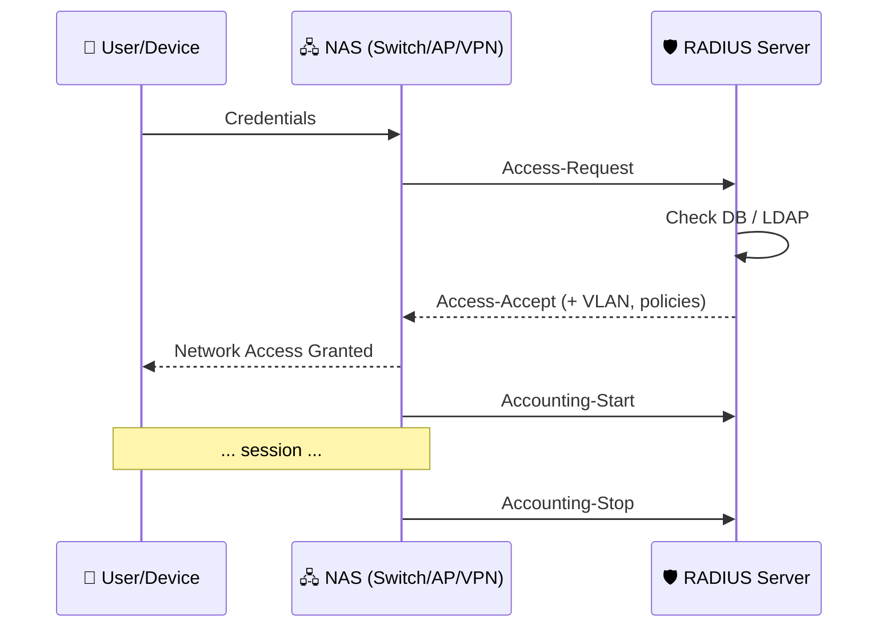
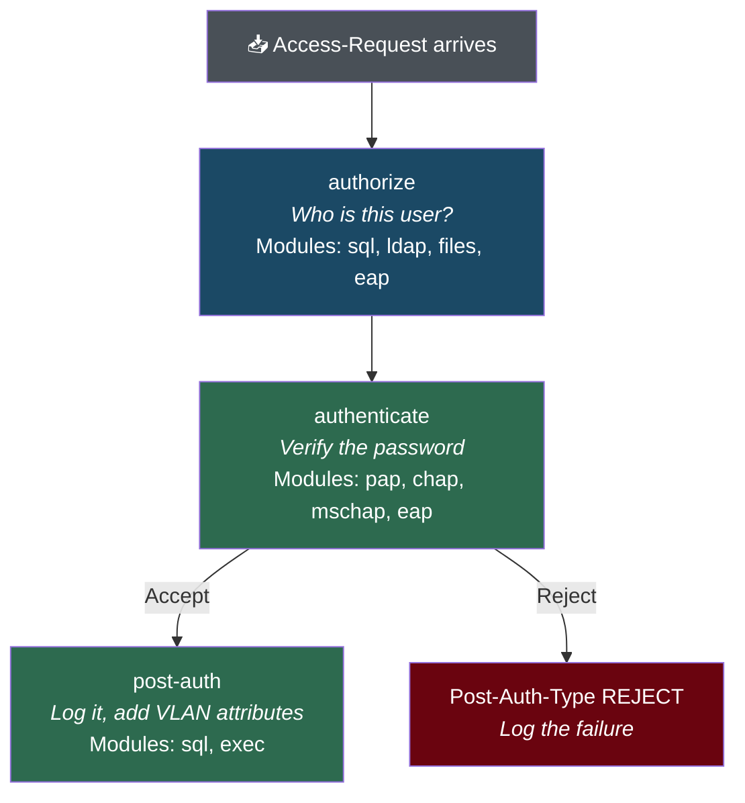
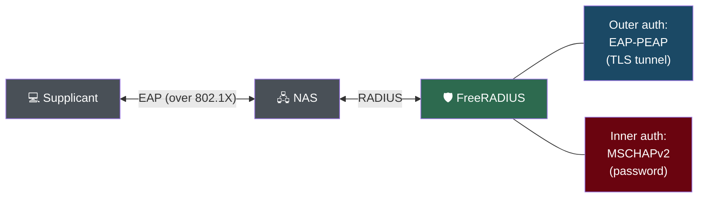
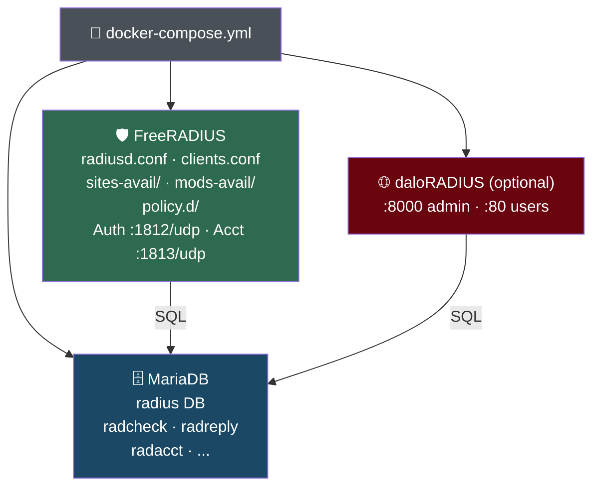

# 2. RADIUS Concepts

This guide explains the fundamental concepts behind RADIUS — what it is, how it works, and how the pieces fit together in this Docker stack.

---

## What is RADIUS?

**RADIUS** (Remote Authentication Dial-In User Service) is a networking protocol that provides centralized **Authentication**, **Authorization**, and **Accounting** (AAA) for users connecting to a network.

Instead of configuring usernames and passwords on every switch, access point, and VPN gateway individually, all devices forward authentication requests to a central RADIUS server.



---

## Key Terminology

| Term | Definition |
|------|-----------|
| **NAS** | Network Access Server — the switch, AP, or VPN gateway that talks to RADIUS |
| **Supplicant** | The client software on the user's device (e.g., Windows 802.1X client) |
| **Shared Secret** | A password shared between the NAS and RADIUS server to encrypt communications |
| **AVP** | Attribute-Value Pair — the key-value data inside RADIUS packets |
| **Realm** | The domain part of a username (e.g., `user@example.com` → realm = `example.com`) |
| **Virtual Server** | A FreeRADIUS processing pipeline (like an Apache virtual host) |
| **Module** | A FreeRADIUS plugin (sql, ldap, eap, pap, etc.) |

---

## RADIUS Packet Types

RADIUS uses **UDP** and has a small set of packet types:

### Authentication (Port 1812)

| Packet | Direction | Purpose |
|--------|-----------|---------|
| **Access-Request** | NAS → RADIUS | "Can this user log in?" (contains username + password) |
| **Access-Accept** | RADIUS → NAS | "Yes, allow access" (may include VLAN, bandwidth limits) |
| **Access-Reject** | RADIUS → NAS | "No, deny access" |
| **Access-Challenge** | RADIUS → NAS | "Need more info" (used in EAP multi-step auth) |

### Accounting (Port 1813)

| Packet | Direction | Purpose |
|--------|-----------|---------|
| **Accounting-Request (Start)** | NAS → RADIUS | "User session started" |
| **Accounting-Request (Interim)** | NAS → RADIUS | "Here's an update on the session" |
| **Accounting-Request (Stop)** | NAS → RADIUS | "User disconnected" (includes bytes, duration) |
| **Accounting-Response** | RADIUS → NAS | "Got it" (acknowledgment) |

### Status (Port 1812)

| Packet | Direction | Purpose |
|--------|-----------|---------|
| **Status-Server** | Monitor → RADIUS | "Are you alive?" (health check) |

---

## Attributes (AVPs)

Every RADIUS packet carries **attributes** — key-value pairs defined by RFCs and vendors. Common attributes:

### Request attributes (sent by NAS)

| Attribute | Example | Purpose |
|-----------|---------|---------|
| `User-Name` | `jdoe` | The username |
| `User-Password` | `MyP@ss` | PAP password (encrypted with shared secret) |
| `NAS-IP-Address` | `10.0.1.1` | IP of the switch/AP |
| `NAS-Port` | `23` | Physical port on the switch |
| `Calling-Station-Id` | `AA-BB-CC-DD-EE-FF` | Client's MAC address |
| `Called-Station-Id` | `11-22-33-44-55-66:SSID` | AP MAC + SSID |
| `Service-Type` | `Framed-User` | Type of service requested |
| `NAS-Port-Type` | `Ethernet` | Physical medium |

### Reply attributes (sent by RADIUS)

| Attribute | Example | Purpose |
|-----------|---------|---------|
| `Tunnel-Type` | `VLAN` | Assign a VLAN |
| `Tunnel-Medium-Type` | `IEEE-802` | VLAN medium |
| `Tunnel-Private-Group-Id` | `100` | VLAN number |
| `Session-Timeout` | `28800` | Max session duration (seconds) |
| `WISPr-Bandwidth-Max-Down` | `5242880` | Download bandwidth limit (bps) |
| `Reply-Message` | `Welcome!` | Text displayed to user |

### Vendor-Specific Attributes (VSA)

Vendors like Cisco, Juniper, and Aruba define their own attributes:

```
# Cisco privilege level for CLI access
Cisco-AVPair = "shell:priv-lvl=15"

# Juniper VLAN assignment
Juniper-Switching-Filter = "..."
```

---

## FreeRADIUS Processing Pipeline

When FreeRADIUS receives an Access-Request, it processes it through a series of **sections** in the virtual server configuration. Think of it like middleware in a web framework:



### Section Details

| Section | When | What happens |
|---------|------|-------------|
| **authorize** | Every request | Look up user in DB/LDAP/files. Set `Auth-Type` (PAP, CHAP, EAP). Load reply attributes (VLAN, etc.). |
| **authenticate** | After authorize | Verify the password using the method set in authorize. |
| **post-auth** | After accept | Log the success to `radpostauth`. Add any final reply attributes. |
| **post-auth REJECT** | After reject | Log the failure. Rate-limit tracking. |
| **accounting** | Acct packets | Write session start/stop/interim to `radacct` table. |
| **session** | If needed | Check `Simultaneous-Use` limits via `radacct`. |

---

## Authentication vs Authorization

These are often confused:

| | Authentication | Authorization |
|-|---------------|---------------|
| **Question** | "Who are you?" | "What are you allowed to do?" |
| **RADIUS** | Verifying username + password | VLAN assignment, bandwidth limits, session timeout |
| **Where** | `radcheck` table (credentials) | `radreply` + `radgroupreply` tables (attributes) |
| **When** | `authenticate` section | `authorize` section (reply attrs loaded from DB) |

Example: User `jdoe` authenticates with password `MyP@ss` (authentication). RADIUS responds with VLAN 100 and 5 Mbps bandwidth limit (authorization).

---

## Realms and Proxying

RADIUS supports **realms** for multi-domain environments. The realm is extracted from the username:

| Username format | Realm |
|----------------|-------|
| `user@example.com` | `example.com` (suffix stripping) |
| `EXAMPLE\user` | `EXAMPLE` (prefix stripping — NT domain) |
| `user` | `NULL` (no realm) |

FreeRADIUS can **proxy** requests based on realm — forwarding `@partner.com` requests to a partner's RADIUS server. In this stack, proxying is disabled by default (`proxy.conf` sets `default_fallback = no`).

---

## EAP (Extensible Authentication Protocol)

EAP is a framework for advanced authentication, most commonly used for **802.1X** (wired/wireless network access control).

EAP is complex because it adds a **tunnel** layer:



The **outer** method (PEAP, TTLS, TLS) establishes an encrypted TLS tunnel. The **inner** method (MSCHAPv2, PAP) sends the actual credentials inside that tunnel.

| EAP Method | Outer | Inner | Use Case |
|------------|-------|-------|----------|
| EAP-PEAP | TLS tunnel | MSCHAPv2 | **Most common** — Windows built-in |
| EAP-TTLS | TLS tunnel | PAP or MSCHAP | Cross-platform, flexible inner auth |
| EAP-TLS | TLS mutual auth | None | Certificate-based (no passwords) |

For deployment details, see [Authentication Methods](04-authentication-methods.md) and [802.1X Deployment](05-802.1x-deployment.md).

---

## Accounting

RADIUS accounting tracks user sessions. The NAS sends:

1. **Accounting-Start** — when the user connects
2. **Accounting-Interim-Update** — periodically during the session
3. **Accounting-Stop** — when the user disconnects

This data is stored in the `radacct` table and includes:

- Session duration
- Bytes sent/received
- NAS IP and port
- Disconnect cause
- Timestamps (start, stop, last update)

Accounting data is used for:
- **Usage reporting** (who was online, for how long)
- **Billing** (data usage tracking)
- **Forensics** (who was on the network at a specific time)
- **Simultaneous-Use** enforcement (prevent account sharing)

---

## How This Stack Implements RADIUS



| Component | RADIUS Role |
|-----------|-------------|
| **`radiusd.conf`** | Main daemon settings (logging, threading, security) |
| **`clients.conf`** | Defines which NAS devices can connect (IP + shared secret) |
| **`sites-available/default`** | The processing pipeline (authorize → authenticate → post-auth) |
| **`sites-available/inner-tunnel`** | EAP Phase 2 (runs inside the TLS tunnel) |
| **`mods-available/sql`** | Connects to MariaDB for user lookup and accounting |
| **`mods-available/eap`** | Configures EAP-PEAP, EAP-TTLS, EAP-TLS |
| **`mods-available/ldap`** | Optional LDAP/AD backend (disabled by default) |
| **`policy.d/`** | Username normalization and rate limiting |
| **`radcheck` table** | User credentials (username + password) |
| **`radreply` table** | Per-user reply attributes (VLAN, etc.) |
| **`radgroupreply` table** | Per-group reply attributes (shared VLAN, bandwidth) |
| **`radusergroup` table** | Maps users to groups |
| **`radacct` table** | Accounting records (session tracking) |

---

## Next

- Ready to deploy? → [Getting Started](01-getting-started.md)
- Want to understand authentication methods in depth? → [Authentication Methods](04-authentication-methods.md)
- Need to add users? → [Database & User Management](06-database-user-management.md)
