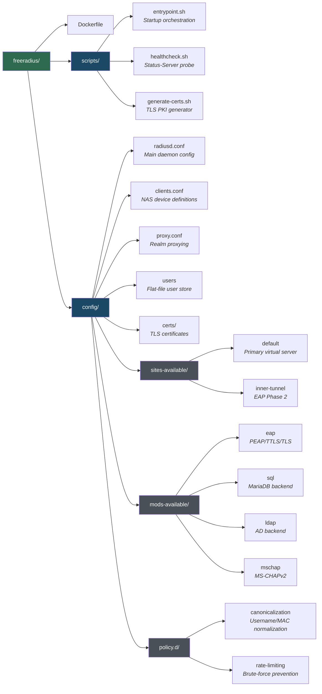

# 3. Configuration Reference

Complete reference for every configuration file, environment variable, and templating mechanism in the stack.

---

## File Map



---

## Environment Variables

### Core Variables (required)

| Variable | Default | Description |
|----------|---------|-------------|
| `DB_HOST` | `db` | MariaDB hostname (Docker service name) |
| `DB_PORT` | `3306` | MariaDB port |
| `DB_NAME` | `radius` | Database name |
| `DB_USER` | `radius` | Database user |
| `DB_PASSWORD` | *(required)* | Database password |
| `DB_ROOT_PASSWORD` | *(required)* | MariaDB root password |
| `RADIUS_CLIENTS_SECRET` | *(required)* | Default shared secret for NAS devices |

### Port Variables

| Variable | Default | Description |
|----------|---------|-------------|
| `RADIUS_AUTH_PORT` | `1812` | RADIUS authentication port (host) |
| `RADIUS_ACCT_PORT` | `1813` | RADIUS accounting port (host) |
| `DB_EXTERNAL_PORT` | `3307` | MariaDB port exposed on host (localhost only) |
| `DALORADIUS_PORT` | `8000` | daloRADIUS operators portal (host) |
| `DALORADIUS_USERS_PORT` | `80` | daloRADIUS users portal (host) |

### TLS Certificate Variables (optional)

| Variable | Default | Description |
|----------|---------|-------------|
| `CERT_CA_CN` | `FreeRADIUS CA` | CA Common Name |
| `CERT_SERVER_CN` | `radius.local` | Server Common Name |
| `CERT_ORG` | `FreeRADIUS Docker` | Organization |
| `CERT_COUNTRY` | `US` | ISO country code |
| `CERT_STATE` | `California` | State / Province |
| `CERT_CITY` | `San Francisco` | City / Locality |
| `CERT_DAYS_CA` | `3650` | CA certificate validity (days) |
| `CERT_DAYS_SERVER` | `825` | Server certificate validity (days) |
| `DH_BITS` | `2048` | Diffie-Hellman parameter bit size |

### Operational Variables

| Variable | Default | Description |
|----------|---------|-------------|
| `RADIUS_DEBUG` | `false` | Start FreeRADIUS in verbose debug mode |
| `TZ` | `UTC` | Container timezone |
| `ACCT_RETENTION_DAYS` | `365` | Days to keep accounting records |
| `POSTAUTH_RETENTION_DAYS` | `90` | Days to keep post-auth logs |

---

## Configuration Templating (envsubst)

The entrypoint injects environment variables into config files using `envsubst` — not `sed`. This safely handles special characters in passwords (like `$`, `&`, `/`, `\`).

### How it works

1. Config files use `${VAR_NAME}` placeholders
2. `entrypoint.sh` calls `envsubst` with an **explicit variable list** so FreeRADIUS built-in variables like `${certdir}` and `${modconfdir}` are preserved
3. Replacement is atomic: `envsubst ... > file.tmp && mv file.tmp file`

### Templated files

| File | Variables injected |
|------|-------------------|
| `mods-available/sql` | `DB_HOST`, `DB_PORT`, `DB_NAME`, `DB_USER`, `DB_PASSWORD` |
| `clients.conf` | `RADIUS_CLIENTS_SECRET` |

### Password escaping

If your password contains `$`, escape it in `.env`:

```env
# Method 1: Backslash escape
DB_PASSWORD=my\$ecret

# Method 2: Single-quote in docker-compose.yml environment section
environment:
  DB_PASSWORD: 'my$ecret'
```

---

## radiusd.conf — Main Daemon Configuration

The top-level FreeRADIUS config file. Controls server-wide settings.

### Key sections

```
# Paths — where FreeRADIUS looks for everything
prefix = /usr
exec_prefix = /usr
sysconfdir = /etc
localstatedir = /var
sbindir = ${exec_prefix}/sbin
raddbdir = /etc/raddb
logdir = /var/log/freeradius

# Logging
log {
    destination = files           # Log to /var/log/freeradius/radius.log
    file = ${logdir}/radius.log
    auth = yes                    # Log auth accept/reject events
    auth_badpass = no             # Don't log failed passwords (security)
    auth_goodpass = no            # Don't log accepted passwords (security)
}

# Thread pool
thread pool {
    start_servers = 5             # Initial worker threads
    max_servers = 32              # Max worker threads
    max_requests_per_server = 0   # Unlimited requests per thread
}

# Security
security {
    max_attributes = 200          # Max AVPs per packet
    reject_delay = 1              # Wait 1s before sending Reject (slows brute force)
    status_server = yes           # Enable Status-Server (health check)
}
```

### What to change

| Setting | When to change |
|---------|---------------|
| `max_servers` | High load — increase to 64 or 128 |
| `reject_delay` | Increase to 2–3 for stronger brute-force protection |
| `auth_badpass` | Set to `yes` temporarily for debugging (never in production) |
| `destination` | Change to `syslog` for centralized logging in production |

---

## clients.conf — NAS Device Definitions

Defines which network devices can send RADIUS requests. Every device needs an entry with a matching shared secret.

### Default configuration

```
# Localhost — for healthcheck and testing
client localhost {
    ipaddr    = 127.0.0.1
    secret    = testing123
    require_message_authenticator = no
}

# Docker network — for containers on the bridge network
client docker-net {
    ipaddr    = 172.28.0.0/24
    secret    = ${RADIUS_CLIENTS_SECRET}
    nastype   = other
    shortname = docker
    require_message_authenticator = yes
}
```

### Adding production NAS devices

```
# Cisco switch
client core-switch-01 {
    ipaddr    = 10.0.1.1
    secret    = UniqueStr0ngP@ssw0rd!
    nastype   = cisco
    shortname = sw01
    require_message_authenticator = yes
}

# Wireless controller (subnet of APs)
client wifi-controllers {
    ipaddr    = 10.0.2.0/24
    secret    = AnotherUn1queS3cret!
    nastype   = other
    shortname = wifi
    require_message_authenticator = yes
}

# VPN gateway
client vpn-gateway {
    ipaddr    = 10.0.0.5
    secret    = VPNr@diusK3y$ecure
    nastype   = other
    shortname = vpn01
    require_message_authenticator = yes
}
```

> **Security:** Use unique, strong secrets (≥ 16 chars) per device. Never reuse the Docker network secret for production NAS devices.

---

## sites-available/default — Primary Virtual Server

The main processing pipeline. This is where authentication actually happens.

### Structure

```
server default {

    # Listen on port 1812 for authentication
    listen {
        type = auth
        ipaddr = *
        port = 0    # Uses default 1812
    }

    # Listen on port 1813 for accounting
    listen {
        type = acct
        ipaddr = *
        port = 0    # Uses default 1813
    }

    # Step 1: Look up the user
    authorize {
        filter_username          # Sanitize username
        filter_password          # Sanitize password
        preprocess               # Handle huntgroups, hints
        suffix                   # Extract realm from user@domain
        eap {                    # Start EAP if it's an EAP request
            ok = return
        }
        sql                      # Look up user in MariaDB
        files                    # Check local 'users' file (fallback)
        expiration               # Check account expiration
        logintime                # Check login hours
        pap                      # Set Auth-Type = PAP if needed
        chap                     # Set Auth-Type = CHAP if needed
        mschap                   # Set Auth-Type = MS-CHAP if needed
    }

    # Step 2: Verify credentials
    authenticate {
        Auth-Type PAP { pap }
        Auth-Type CHAP { chap }
        Auth-Type MS-CHAP { mschap }
        eap                      # Handle EAP (PEAP/TTLS/TLS)
    }

    # Step 3: Accounting
    accounting {
        detail                   # Write detail file
        sql                      # Write to radacct table
        exec
        attr_filter.accounting_response
    }

    # Step 4: Session tracking
    session {
        sql                      # Check Simultaneous-Use via radacct
    }

    # Step 5: Post-authentication
    post-auth {
        sql                      # Log to radpostauth

        Post-Auth-Type REJECT {
            sql                  # Log rejections too
            eap                  # Clean up EAP state
        }
    }
}
```

---

## sites-available/inner-tunnel — EAP Phase 2

Handles the **inner authentication** inside EAP-PEAP/TTLS tunnels. When a PEAP request comes in, the outer `default` server handles the TLS handshake, then forwards the inner credentials here.

The inner tunnel:
- Listens on `localhost:18120` (internal only)
- Runs `authorize` → `authenticate` → `post-auth` just like `default`
- Modules: sql, files, pap, chap, mschap, eap

---

## mods-available/eap — EAP Configuration

Controls 802.1X authentication methods.

### Key settings

```
eap {
    default_eap_type = peap          # Default to PEAP (most common)
    timer_expire = 60                # EAP conversation timeout

    tls-config tls-common {
        private_key_file = /etc/raddb/certs/server.key
        certificate_file = /etc/raddb/certs/server.pem
        ca_file          = /etc/raddb/certs/ca.pem
        dh_file          = /etc/raddb/certs/dh

        tls_min_version = "1.2"      # Minimum TLS version
        tls_max_version = "1.3"      # Maximum TLS version

        # Modern cipher suites
        cipher_list = "ECDHE+AESGCM:ECDHE+CHACHA20:..."

        # Session caching (avoids full re-auth)
        cache {
            enable = yes
            lifetime = 24             # hours
            max_entries = 255
        }
    }

    peap {
        tls = tls-common
        default_eap_type = mschapv2  # Inner auth method
        virtual_server = inner-tunnel
    }

    ttls {
        tls = tls-common
        default_eap_type = md5
        virtual_server = inner-tunnel
    }

    tls {
        tls = tls-common             # Certificate-only auth
    }

    mschapv2 {
        send_error = no
    }
}
```

### What to change

| Setting | When to change |
|---------|---------------|
| `default_eap_type` | Change to `ttls` if most clients are non-Windows |
| `tls_min_version` | Lower to `"1.0"` only for legacy devices (not recommended) |
| `certificate_file` | Point to production PKI cert |
| `cache.lifetime` | Increase for better performance, decrease for tighter security |

---

## mods-available/sql — Database Backend

Connects FreeRADIUS to MariaDB for user authentication and accounting.

```
sql {
    driver = "rlm_sql_mysql"
    dialect = "mysql"

    server   = "${DB_HOST}"
    port     = ${DB_PORT}
    login    = "${DB_USER}"
    password = "${DB_PASSWORD}"
    radius_db = "${DB_NAME}"

    # Table names
    authcheck_table  = "radcheck"
    authreply_table  = "radreply"
    groupcheck_table = "radgroupcheck"
    groupreply_table = "radgroupreply"
    usergroup_table  = "radusergroup"
    acct_table1      = "radacct"
    acct_table2      = "radacct"
    postauth_table   = "radpostauth"

    # Connection pool
    pool {
        start = 5                    # Initial connections
        min   = 5                    # Minimum idle connections
        max   = 32                   # Maximum connections
        idle_timeout = 60            # Close idle after 60s
        retry_delay  = 30            # Wait 30s before retry on failure
    }

    read_clients = yes               # Load NAS entries from 'nas' table too
}
```

---

## mods-available/ldap — LDAP / Active Directory

Connects to LDAP or Active Directory for user authentication. **Disabled by default** — see [LDAP & Active Directory](08-ldap-active-directory.md) to enable.

### Key settings (configured for AD)

```
ldap {
    server   = 'ldaps://dc01.example.com'
    port     = 636
    identity = 'CN=svc-radius,OU=Service Accounts,DC=example,DC=com'
    password = 'CHANGE_ME'
    base_dn  = 'DC=example,DC=com'

    user {
        base_dn   = "${..base_dn}"
        filter    = "(sAMAccountName=%{%{Stripped-User-Name}:-%{User-Name}})"
    }

    group {
        base_dn       = "${..base_dn}"
        membership_attribute = "memberOf"
        name_attribute = "cn"
    }

    tls {
        require_cert = "demand"
    }
}
```

---

## mods-available/mschap — MS-CHAPv2

Handles MS-CHAPv2 authentication (used inside EAP-PEAP).

```
mschap {
    use_mppe           = yes        # Enable MPPE encryption
    require_encryption = yes        # Require encryption
    require_strong     = yes        # Require 128-bit MPPE
    with_ntdomain_hack = yes        # Strip DOMAIN\ prefix from username
}
```

For Active Directory integration with `ntlm_auth`, see [LDAP & Active Directory](08-ldap-active-directory.md).

---

## policy.d/canonicalization — Username Normalization

Ensures consistent username formatting:

- **`rewrite_calling_station_id`**: Converts MAC addresses to lowercase, hyphen-separated format (`aa-bb-cc-dd-ee-ff`)
- **`filter_username`**: Lowercases `User-Name` into `Stripped-User-Name`

This prevents issues where `JDOE`, `jdoe`, and `Jdoe` are treated as different users.

---

## policy.d/rate-limiting — Brute-force Prevention

Logs authentication failures with client IP for integration with external tools:

```
policy rate_limit_log {
    if (reject) {
        # Logs: "Login incorrect: [username] (from client <IP>)"
        # → Parseable by fail2ban
    }
}
```

### fail2ban integration

The config includes a ready-to-use fail2ban filter:

```ini
# /etc/fail2ban/filter.d/freeradius.conf
[Definition]
failregex = Login incorrect.*client <HOST>

# /etc/fail2ban/jail.d/freeradius.conf
[freeradius]
enabled  = true
port     = 1812,1813
protocol = udp
filter   = freeradius
logpath  = /path/to/radius.log
maxretry = 5
findtime = 300
bantime  = 3600
```

---

## proxy.conf — Realm Proxying

Proxying is **disabled by default**. The file defines three realms:

| Realm | Action |
|-------|--------|
| `LOCAL` | Process locally (no proxy) |
| `NULL` | Process locally (no realm in username) |
| `DEFAULT` | Process locally (`default_fallback = no`) |

To enable proxying to a federation or partner RADIUS, uncomment and configure `home_server` and `home_server_pool` entries.

---

## users — Local Flat-file Users

The `users` file is a **fallback** user store, checked after SQL and LDAP. This stack uses it for one purpose:

```
# Emergency access — when the database is down
breakglass  Cleartext-Password := "EmergencyAccess123!"
            Service-Type = NAS-Prompt-User,
            Cisco-AVPair = "shell:priv-lvl=15"
```

> **Important:** Change the `breakglass` password and rotate it regularly. This account bypasses the database entirely.

---

## Entrypoint Startup Sequence

`freeradius/scripts/entrypoint.sh` runs 8 steps:

| Step | Action | Details |
|------|--------|---------|
| 1 | Validate environment | Fails fast if `DB_HOST`, `DB_PASSWORD`, `RADIUS_CLIENTS_SECRET` are missing |
| 2 | Apply custom configs | Copies any files from `/etc/raddb-custom/` overlay |
| 3 | Inject variables | `envsubst` on `mods-available/sql` and `clients.conf` |
| 4 | Enable modules | Creates symlinks: `sql`, `eap`, `mschap` → `mods-enabled/` |
| 5 | Generate TLS certs | Runs `generate-certs.sh` if `server.pem` doesn't exist |
| 6 | Wait for database | Retries `mariadb` ping up to 30 times (2s apart) |
| 7 | Validate config | `radiusd -XC` to check config syntax without starting |
| 8 | Start FreeRADIUS | Debug mode: `radiusd -X`. Production: `radiusd -f` |

---

## Next

- [Authentication Methods](04-authentication-methods.md) — PAP, CHAP, EAP in depth
- [Database & User Management](06-database-user-management.md) — Working with SQL tables
- [LDAP & Active Directory](08-ldap-active-directory.md) — Enable AD backend
