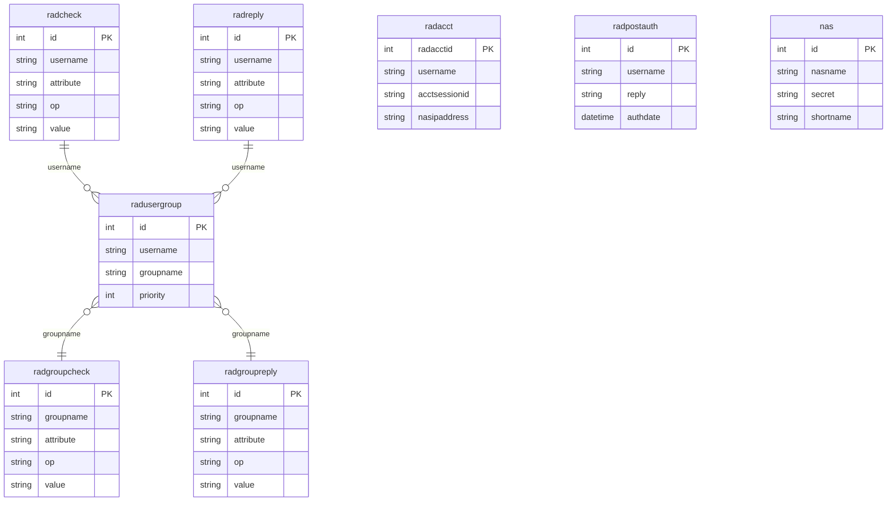

# 6. Database & User Management

Complete guide to the RADIUS database schema, managing users and groups, VLAN assignment, accounting, and the Makefile shortcuts.

---

## Database Schema Overview

The stack uses MariaDB with the standard FreeRADIUS schema (8 core tables):



### Table Reference

| Table | Purpose | Key Columns |
|-------|---------|-------------|
| `radcheck` | User credentials | `username`, `attribute`, `op`, `value` |
| `radreply` | Per-user reply attributes | `username`, `attribute`, `op`, `value` |
| `radusergroup` | User → group mapping | `username`, `groupname`, `priority` |
| `radgroupcheck` | Group check attributes | `groupname`, `attribute`, `op`, `value` |
| `radgroupreply` | Group reply attributes (VLAN, etc.) | `groupname`, `attribute`, `op`, `value` |
| `radacct` | Accounting / session records | `username`, `acctsessionid`, timestamps, bytes |
| `radpostauth` | Authentication success/fail log | `username`, `reply`, `authdate` |
| `nas` | NAS client registry (alternative to `clients.conf`) | `nasname`, `secret`, `shortname` |

---

## Connecting to the Database

### Via Makefile

```bash
make db-shell
```

### Via Docker

```bash
docker exec -it mariadb mariadb -u radius -p"$DB_PASSWORD" radius
```

### Via host (if `DB_EXTERNAL_PORT` is set)

```bash
mariadb -h 127.0.0.1 -P 3307 -u radius -p radius
```

---

## User Management

### Quick commands (Makefile)

```bash
# Add a user
make add-user USER=jdoe PASS='MyP@ssw0rd!' GROUP=employees

# List all users
make list-users

# Delete a user
make delete-user USER=jdoe
```

### Add a user (SQL)

```sql
-- 1. Add credentials
INSERT INTO radcheck (username, attribute, op, value)
VALUES ('jdoe', 'Cleartext-Password', ':=', 'MyP@ssw0rd!');

-- 2. Assign to a group
INSERT INTO radusergroup (username, groupname, priority)
VALUES ('jdoe', 'employees', 1);
```

### Add a user with per-user VLAN override

```sql
-- Credentials
INSERT INTO radcheck (username, attribute, op, value)
VALUES ('special-user', 'Cleartext-Password', ':=', 'MyP@ss!');

-- Group (gets group defaults)
INSERT INTO radusergroup (username, groupname, priority)
VALUES ('special-user', 'employees', 1);

-- Override group VLAN with per-user VLAN
INSERT INTO radreply (username, attribute, op, value) VALUES
('special-user', 'Tunnel-Type',             ':=', 'VLAN'),
('special-user', 'Tunnel-Medium-Type',      ':=', 'IEEE-802'),
('special-user', 'Tunnel-Private-Group-Id', ':=', '250');
```

> Per-user `radreply` attributes override `radgroupreply` attributes.

### Change a user's password

```sql
UPDATE radcheck
SET value = 'NewP@ssw0rd!'
WHERE username = 'jdoe' AND attribute = 'Cleartext-Password';
```

### Disable a user (without deleting)

```sql
-- Add an Auth-Type := Reject check
INSERT INTO radcheck (username, attribute, op, value)
VALUES ('jdoe', 'Auth-Type', ':=', 'Reject');
```

To re-enable:

```sql
DELETE FROM radcheck
WHERE username = 'jdoe' AND attribute = 'Auth-Type' AND value = 'Reject';
```

### Set account expiration

```sql
INSERT INTO radcheck (username, attribute, op, value)
VALUES ('contractor.a', 'Expiration', ':=', '31 Dec 2026 23:59:59');
```

### Limit simultaneous sessions

```sql
INSERT INTO radcheck (username, attribute, op, value)
VALUES ('jdoe', 'Simultaneous-Use', ':=', '1');
```

### Delete a user completely

```sql
DELETE FROM radcheck WHERE username = 'jdoe';
DELETE FROM radreply WHERE username = 'jdoe';
DELETE FROM radusergroup WHERE username = 'jdoe';
```

### List all users and their groups

```sql
SELECT
    rc.username,
    rc.attribute,
    rug.groupname,
    rc.value AS credential
FROM radcheck rc
LEFT JOIN radusergroup rug ON rc.username = rug.username
WHERE rc.attribute = 'Cleartext-Password'
ORDER BY rc.username;
```

---

## Group Management

### Pre-configured groups

The seed data (`02-seed-data.sql`) creates these groups:

#### employees (VLAN 100)

```sql
-- radgroupreply entries:
('employees', 'Tunnel-Type',             ':=', 'VLAN')
('employees', 'Tunnel-Medium-Type',      ':=', 'IEEE-802')
('employees', 'Tunnel-Private-Group-Id', ':=', '100')
```

#### guests (VLAN 200 + bandwidth limits)

```sql
('guests', 'Tunnel-Type',               ':=', 'VLAN')
('guests', 'Tunnel-Medium-Type',        ':=', 'IEEE-802')
('guests', 'Tunnel-Private-Group-Id',   ':=', '200')
('guests', 'WISPr-Bandwidth-Max-Down',  ':=', '5242880')    -- 5 Mbps
('guests', 'WISPr-Bandwidth-Max-Up',    ':=', '2097152')    -- 2 Mbps
('guests', 'Simultaneous-Use',          ':=', '1')
```

#### admins (VLAN 10 + Cisco privilege level)

```sql
('admins', 'Tunnel-Type',             ':=', 'VLAN')
('admins', 'Tunnel-Medium-Type',      ':=', 'IEEE-802')
('admins', 'Tunnel-Private-Group-Id', ':=', '10')
('admins', 'Cisco-AVPair',            '+=', 'shell:priv-lvl=15')
```

#### contractors (VLAN 150 + session timeout)

```sql
('contractors', 'Tunnel-Type',             ':=', 'VLAN')
('contractors', 'Tunnel-Medium-Type',      ':=', 'IEEE-802')
('contractors', 'Tunnel-Private-Group-Id', ':=', '150')
('contractors', 'Session-Timeout',         ':=', '28800')    -- 8 hours
```

### Create a new group

```sql
-- Example: IoT devices on VLAN 300 with 1 Mbps bandwidth
INSERT INTO radgroupreply (groupname, attribute, op, value) VALUES
('iot-devices', 'Tunnel-Type',              ':=', 'VLAN'),
('iot-devices', 'Tunnel-Medium-Type',       ':=', 'IEEE-802'),
('iot-devices', 'Tunnel-Private-Group-Id',  ':=', '300'),
('iot-devices', 'WISPr-Bandwidth-Max-Down', ':=', '1048576'),
('iot-devices', 'WISPr-Bandwidth-Max-Up',   ':=', '524288');
```

### Delete a group

```sql
DELETE FROM radgroupreply WHERE groupname = 'iot-devices';
DELETE FROM radgroupcheck WHERE groupname = 'iot-devices';
DELETE FROM radusergroup WHERE groupname = 'iot-devices';
```

### Move a user to a different group

```sql
UPDATE radusergroup
SET groupname = 'admins'
WHERE username = 'jdoe';
```

### Multiple group membership

A user can belong to multiple groups. The `priority` column determines precedence (lower = higher priority):

```sql
INSERT INTO radusergroup (username, groupname, priority) VALUES
('jdoe', 'employees',  1),   -- Primary group (VLAN from here)
('jdoe', 'vpn-users',  2);   -- Secondary group (extra attributes)
```

---

## Operators and Attribute Operators

The `op` column in `radcheck` / `radreply` controls how attributes are matched or applied:

### Check operators (radcheck)

| Operator | Meaning | Example |
|----------|---------|---------|
| `:=` | **Set** — assign unconditionally | `Cleartext-Password := "pass"` |
| `==` | **Match** — must equal | `NAS-IP-Address == "10.0.1.1"` |
| `!=` | **Not match** | `Service-Type != "Login-User"` |
| `>=` | Greater than or equal | — |
| `<=` | Less than or equal | — |

### Reply operators (radreply / radgroupreply)

| Operator | Meaning | Example |
|----------|---------|---------|
| `:=` | **Replace** — set (overwrite if exists) | `Tunnel-Private-Group-Id := "100"` |
| `=` | **Set if not exists** | — |
| `+=` | **Append** — add to reply (allows multiple) | `Cisco-AVPair += "shell:priv-lvl=15"` |

> **Rule of thumb:** Use `:=` for most attributes. Use `+=` when adding multiple values for the same attribute (e.g., multiple Cisco-AVPairs).

---

## Accounting Data

### View active sessions

```sql
SELECT
    username,
    nasipaddress,
    nasportid,
    framedipaddress,
    acctstarttime,
    TIMESTAMPDIFF(MINUTE, acctstarttime, NOW()) AS minutes_online
FROM radacct
WHERE acctstoptime IS NULL
ORDER BY acctstarttime;
```

### View recent disconnections

```sql
SELECT
    username,
    acctstarttime,
    acctstoptime,
    accsessiontime AS duration_seconds,
    acctinputoctets AS bytes_up,
    acctoutputoctets AS bytes_down,
    acctterminatecause
FROM radacct
WHERE acctstoptime IS NOT NULL
ORDER BY acctstoptime DESC
LIMIT 20;
```

### User session history

```sql
SELECT
    acctstarttime,
    acctstoptime,
    accsessiontime,
    nasipaddress,
    framedipaddress,
    acctinputoctets + acctoutputoctets AS total_bytes
FROM radacct
WHERE username = 'jdoe'
ORDER BY acctstarttime DESC;
```

### Authentication log

```sql
-- Recent auth attempts (success and failure)
SELECT username, reply, authdate
FROM radpostauth
ORDER BY id DESC
LIMIT 30;

-- Failed attempts only
SELECT username, reply, authdate
FROM radpostauth
WHERE reply != 'Access-Accept'
ORDER BY id DESC
LIMIT 30;

-- Failed attempts by IP (potential brute force)
SELECT username, COUNT(*) AS failures, MAX(authdate) AS last_attempt
FROM radpostauth
WHERE reply = 'Access-Reject'
AND authdate > DATE_SUB(NOW(), INTERVAL 1 HOUR)
GROUP BY username
ORDER BY failures DESC;
```

### Bandwidth usage per user

```sql
SELECT
    username,
    COUNT(*) AS sessions,
    SUM(acctinputoctets) / 1048576 AS upload_mb,
    SUM(acctoutputoctets) / 1048576 AS download_mb,
    SUM(accsessiontime) / 3600 AS total_hours
FROM radacct
WHERE acctstarttime >= DATE_SUB(NOW(), INTERVAL 30 DAY)
GROUP BY username
ORDER BY download_mb DESC;
```

---

## Database Maintenance

### Automated cleanup

Schedule cleanup of old records:

```bash
# Run cleanup now
make db-maintenance

# Schedule weekly (add to host crontab)
0 3 * * 0  cd /path/to/freeradius-docker && make db-maintenance
```

Default retention:
- Accounting records: **365 days**
- Post-auth logs: **90 days**

Override with environment variables:

```env
ACCT_RETENTION_DAYS=180
POSTAUTH_RETENTION_DAYS=30
```

### Manual cleanup

```sql
-- Delete accounting older than 6 months
DELETE FROM radacct
WHERE acctstarttime < DATE_SUB(NOW(), INTERVAL 180 DAY);

-- Delete post-auth older than 30 days
DELETE FROM radpostauth
WHERE authdate < DATE_SUB(NOW(), INTERVAL 30 DAY);

-- Check table sizes
SELECT
    table_name,
    ROUND(data_length / 1048576, 2) AS data_mb,
    table_rows
FROM information_schema.tables
WHERE table_schema = 'radius'
ORDER BY data_length DESC;
```

### Backup the database

```bash
# Full dump
docker exec mariadb mariadb-dump -u root -p"$DB_ROOT_PASSWORD" radius > backup.sql

# Restore
docker exec -i mariadb mariadb -u root -p"$DB_ROOT_PASSWORD" radius < backup.sql
```

---

## Seed Data Reference

The file `db/init/02-seed-data.sql` creates sample users for testing:

| Username | Password | Group | VLAN |
|----------|----------|-------|------|
| `testuser` | `TestPass123!` | employees | 100 |
| `admin.test` | `AdminPass456!` | admins | 10 |
| `guest01` | `GuestPass789!` | guests | 200 |
| `contractor.a` | `ContractorABC!` | contractors | 150 |

> **Warning:** Remove or change these seed users before deploying to production. See [Security Hardening](10-security-hardening.md).

---

## Next

- [daloRADIUS Administration](07-daloradius-guide.md) — Web UI for user management
- [LDAP & Active Directory](08-ldap-active-directory.md) — Authenticate against AD instead of SQL
- [Troubleshooting](11-troubleshooting.md) — Debug auth failures
