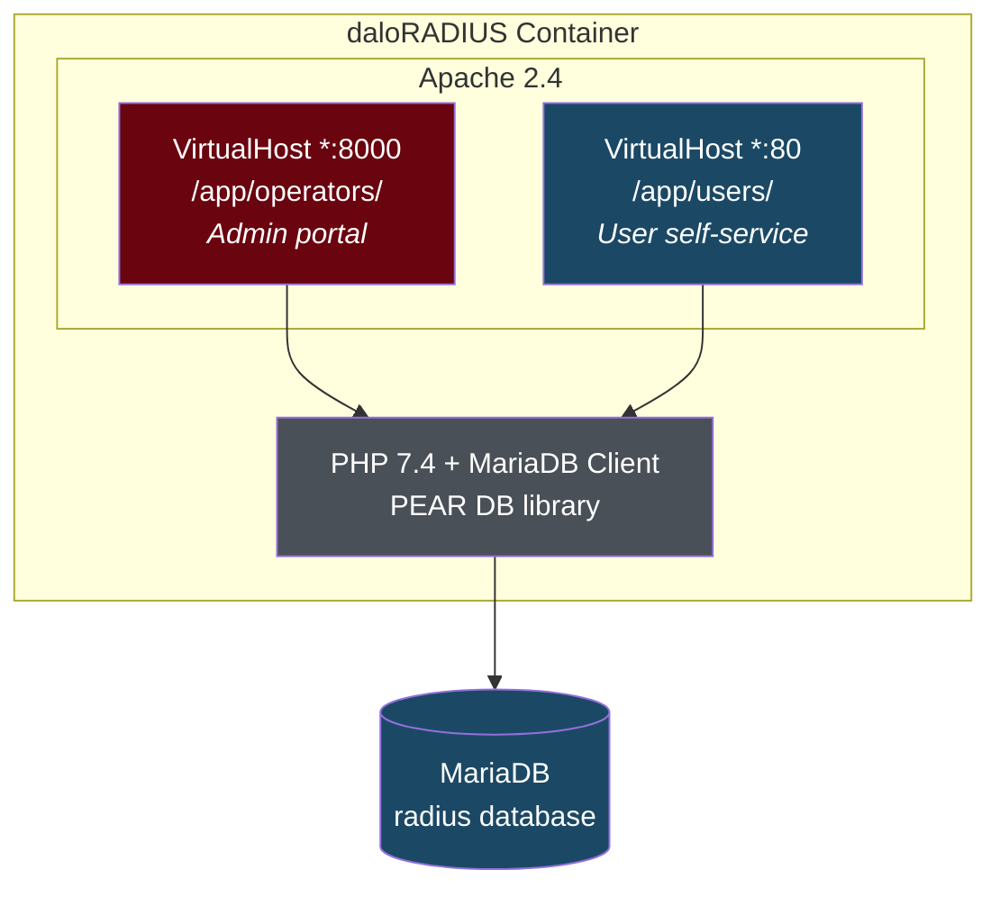

# 7. daloRADIUS Administration Guide

daloRADIUS is an optional web-based management interface for FreeRADIUS. This guide covers setup, features, and administration of both portals.

---

## Architecture

daloRADIUS provides **two separate web portals** running in a single container:



| Portal | Port | URL | Auth Table | Purpose |
|--------|------|-----|-----------|---------|
| **Operators** | 8000 | `http://localhost:8000` | `operators` | Full admin: users, groups, NAS, accounting, reports |
| **Users** | 80 | `http://localhost:80` | `userinfo` | Self-service: view usage, change password |

---

## Starting daloRADIUS

daloRADIUS uses a Docker Compose profile and does **not** start by default:

```bash
# Start
make mgmt-up

# Stop
make mgmt-down
```

Or with docker compose directly:

```bash
docker compose --profile management up -d
docker compose --profile management down
```

### First boot

On first start, the daloRADIUS entrypoint:

1. Creates `daloradius.conf.php` from the sample config
2. Injects database credentials (host, port, user, password, database name)
3. Imports the daloRADIUS schema (`mariadb-daloradius.sql`) if the `operators` table doesn't exist
4. Configures Apache to listen on port 8000
5. Starts Apache in foreground mode

---

## Operators Portal (Admin)

### Login

- **URL:** `http://localhost:8000`
- **Username:** `administrator`
- **Password:** `radius`

> **Change the default password immediately** after first login.

### Key Features

#### User Management (Management → Users)

| Action | Description |
|--------|-------------|
| **New User** | Create user with password, group, attributes |
| **List Users** | View all users in `radcheck` |
| **Edit User** | Modify password, add/remove attributes |
| **Delete User** | Remove from all tables |
| **Search** | Find by username, attribute, or value |

When creating a user through daloRADIUS:
- The password is stored in `radcheck` as `Cleartext-Password`
- You can assign groups (writes to `radusergroup`)
- You can set reply attributes (writes to `radreply`)

#### Group Management (Management → Groups)

| Action | Description |
|--------|-------------|
| **New Group** | Create a group with reply attributes |
| **List Groups** | View all groups and their attributes |
| **Edit Group** | Modify VLAN, bandwidth, timeout settings |
| **Group Members** | View/modify users in a group |

#### NAS Management (Management → NAS)

Manage RADIUS clients from the web UI (stored in the `nas` table):

| Field | Description |
|-------|-------------|
| NAS Name | IP address or hostname |
| Short Name | Friendly identifier |
| Secret | Shared secret |
| Type | Vendor type (cisco, juniper, other) |
| Description | Notes |

> **Note:** NAS entries in the `nas` table are loaded by FreeRADIUS when `read_clients = yes` in the SQL module. Entries in `clients.conf` are always loaded. You can use both.

#### Accounting (Reports → Accounting)

View session records from the `radacct` table:

- Active sessions (no stop time)
- Session history per user
- Top users by bandwidth
- Disconnect reasons

#### Post-Auth Log (Reports → Post-Auth)

View authentication success/failure log from `radpostauth`:

- Filter by username, date range, result
- Identify brute-force attempts (multiple failures for same username)

#### Server Status (Reports → Server Status)

- FreeRADIUS version and uptime
- Database connection status
- Active session count

### Operator Management

#### Change admin password

1. Go to **Management → Operators → List Operators**
2. Click **Edit** on `administrator`
3. Enter new password
4. Click **Apply**

#### Create additional operators

1. Go to **Management → Operators → New Operator**
2. Fill in username, password
3. Set permissions (read-only, read-write, full admin)
4. Click **Apply**

### Operator permissions

| Permission Level | Can Do |
|-----------------|--------|
| Read-only | View users, groups, reports |
| Read-write | Create/edit users and groups |
| Full admin | Everything, including operator management |

---

## Users Portal (Self-Service)

### Overview

The users portal allows end-users to manage their own accounts without admin help.

- **URL:** `http://localhost:80`
- **Auth table:** `userinfo` (separate from `radcheck`)

### Enabling user self-service

For a user to access the self-service portal, they need an entry in the `userinfo` table:

```sql
INSERT INTO userinfo (
    username,
    enableportallogin,
    portalloginpassword
) VALUES (
    'jdoe',
    1,                    -- Enable portal login
    'SelfServiceP@ss!'    -- Portal password (separate from RADIUS password)
);
```

> **Important:** The portal password (`portalloginpassword`) is separate from the RADIUS password (`radcheck`). The user has two passwords — one for network access and one for the web portal.

### User portal features

| Feature | Description |
|---------|-------------|
| **View Profile** | See account details |
| **Change Password** | Update RADIUS password |
| **Usage Statistics** | View bandwidth and session history |
| **Account Info** | See group membership, VLAN, limits |

---

## Common Tasks

### Bulk user import

Create a CSV file and import via SQL:

```sql
-- CSV format: username,password,group
LOAD DATA LOCAL INFILE '/tmp/users.csv'
INTO TABLE radcheck
FIELDS TERMINATED BY ','
LINES TERMINATED BY '\n'
(username, @dummy, @dummy)
SET attribute = 'Cleartext-Password', op = ':=', value = @password;
```

Or use the Makefile in a loop:

```bash
while IFS=, read -r user pass group; do
    make add-user USER="$user" PASS="$pass" GROUP="$group"
done < users.csv
```

### Export user list

```bash
make db-shell
```

```sql
SELECT
    rc.username,
    rc.value AS password,
    rug.groupname
FROM radcheck rc
LEFT JOIN radusergroup rug ON rc.username = rug.username
WHERE rc.attribute = 'Cleartext-Password'
INTO OUTFILE '/tmp/users-export.csv'
FIELDS TERMINATED BY ','
LINES TERMINATED BY '\n';
```

### Reset a user's password via daloRADIUS

1. Login to operators portal (`http://localhost:8000`)
2. **Management → Users → Search**
3. Enter username, click **Search**
4. Click **Edit** on the user
5. Update the password field
6. Click **Apply**

---

## Troubleshooting daloRADIUS

### "Cannot Log In" error

**Most common cause:** You are on the wrong portal.

| If you're trying to... | Go to... |
|------------------------|----------|
| Admin login | `http://localhost:8000` (operators portal) |
| User self-service | `http://localhost:80` (users portal) |

The operators portal (`:8000`) authenticates against the `operators` table with default `administrator` / `radius`.

The users portal (`:80`) authenticates against the `userinfo` table — users must have `enableportallogin = 1`.

### Database connection error

```bash
# Check daloRADIUS logs
docker logs daloradius --tail 50

# Test database connectivity from the container
docker exec daloradius mariadb -h db -u radius -p"$DB_PASSWORD" radius -e "SELECT 1;"

# Verify config was injected correctly
docker exec daloradius cat /var/www/daloradius/app/common/includes/daloradius.conf.php | grep -E "CONFIG_DB"
```

### Blank page / PHP errors

```bash
# Check Apache error logs
docker exec daloradius cat /var/log/apache2/operators-error.log
docker exec daloradius cat /var/log/apache2/users-error.log

# Check PHP is working
docker exec daloradius php -v
```

### Schema not imported

```bash
# Check if the operators table exists
docker exec daloradius mariadb -h db -u radius -p"$DB_PASSWORD" radius \
    -e "SHOW TABLES LIKE 'operators';"

# Manually import if missing
docker exec daloradius mariadb -h db -u radius -p"$DB_PASSWORD" radius \
    < /var/www/daloradius/contrib/db/mariadb-daloradius.sql
```

---

## Security Considerations

- **Disable in production:** Don't run daloRADIUS in production unless you need it. Use `make mgmt-down` or don't deploy with `--profile management`.
- **Change default password:** The default `administrator` / `radius` must be changed immediately.
- **Restrict access:** Use firewall rules to limit access to ports 8000 and 80 to admin workstations only.
- **HTTPS:** In production, put daloRADIUS behind a reverse proxy (nginx/Traefik) with TLS.
- **Operator accounts:** Create individual operator accounts for audit trails. Don't share the `administrator` account.

---

## Next

- [Database & User Management](06-database-user-management.md) — Direct SQL management
- [LDAP & Active Directory](08-ldap-active-directory.md) — AD integration
- [Troubleshooting](11-troubleshooting.md) — Full troubleshooting guide
